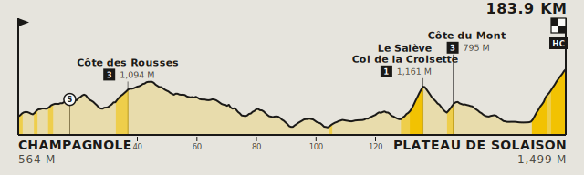

# stage-profiler

A simple stage profile generator from GPX file and a configuration. Describe the routes in a JSON manifest and get back on-brand stage posters (PNG & SVG).



```bash
stage-profiler races.json
```

The two visuals:

- **Stage profile**: the elevation silhouette filled with the race colour **segmented by
  steepness** (darker tones for steeper gradients) under a bold ink outline, categorised
  climbs over their summits (ink **HC/1–4 badge** · altitude · name, on location rules that
  run down through the mountain), intermediate **sprints** on the route line, start/finish
  towns + elevations at the corners bookended by a **départ pennant** and a **checkered
  finish flag**, and a **km scale** along the foot. No header — the route is the chart.

- **Stage map** (WIP):  a country outline simplified into soft land, with a hollow-green **start**
  ring and a solid-green **finish** dot, each labelled with its town + elevation.

You only ever supply data; the whole look lives in one place
([`theme.py`](src/stage_profiler/theme.py)), and every element carries a CSS class for
re-theming at display time.

---

## Install

```bash
git clone https://github.com/dontseyit/stage-profiler.git
cd stage-profiler
pip install -e .
```

Requires Python 3.9+. Installing pulls in **shapely** and **pyproj** (used by the map). PNG
output additionally needs **`rsvg-convert`** (`brew install librsvg`); without it the
command writes SVG only.

---

## Usage

`stage-profiler` takes one argument — where your races are — and writes a profile (and a
map, when a race gives map inputs) for each, as a self-contained **SVG and a matching PNG**:

```bash
stage-profiler races.json                 # a manifest → its output_dir (default build/)
stage-profiler races.json --out posters/  # …to a directory you choose
stage-profiler routes/                    # a folder → a profile for every .gpx in it
stage-profiler stage-4.gpx --no-png       # a single route, SVG only
```

Flags: `-o/--out DIR` (output directory), `--no-png` (skip PNG rasterisation), `--scale N`
(PNG resolution, default 2×). A race that fails is logged and skipped so the rest still
render. `python -m stage_profiler …` works identically if the script isn't on your `PATH`.

Try it on the three bundled example stages:

```bash
stage-profiler examples/races.example.json
```

### The manifest

A manifest is a JSON object with a `races` array; **every path resolves relative to the
manifest file**. Only `gpx` is required, everything else is optional roadbook data:

```json
{
  "output_dir": "output",
  "races": [
    {
      "gpx": "stage-4-parcours.gpx",
      "name": "Carcassonne — Foix",
      "start_town": "Carcassonne",
      "finish_town": "Foix",
      "accent": "#E4002B",
      "sprints": [93.4],
      "length_km": 181.9,
      "climbs": [
        { "name": "Col de Coudons", "km": 104.9, "category": "2" },
        { "name": "Col de Montségur", "km": 146.7, "category": "1", "offset": -30 }
      ],
      "map": {
        "geojson": "fra.geojson",
        "start": [2.3536, 43.2130],
        "end": [1.6091, 42.9660]
      }
    }
  ]
}
```

Per race:

- **`gpx`** *(required)* — the route.
- **`name`** — title used for filenames/reporting; it is **not** drawn.
- **`start_town` / `finish_town`** — the corner labels (their elevations come from the GPX).
- **`accent`** — the race colour tinting the silhouette (maillot-jaune yellow when omitted).
- **`sprints`** — intermediate-sprint kilometres, each marked on the route line with a rule
  down to the km scale.
- **`length_km`** — clip a route that's longer than the real stage (a neutral start zone or
  GPS overrun): the tail is dropped, that point becomes the drawn finish, and the metrics
  are recomputed for the shortened stage.
- **`climbs`** — named climbs, each `{ "name", "km", "category"?, "offset"? }`. `km` is the
  summit's distance along the route; `category` is the UCI badge (`"HC"`, `"1"`–`"4"`; omit
  for an uncategorised climb). A name may contain `\n` to wrap onto two stacked lines.
  `offset` nudges just the **label** left (`-`) / right (`+`) in canvas units while its rule
  stays on the summit — use it to pull apart labels that would overlap. A climb topping out
  at the finish is drawn as a **mountaintop finish**: its badge sits under the finish flag.
- **`map`** *(omit for a profile-only race)* — `{ "geojson", "start"?, "end"? }`, where
  `start` / `end` are `[lon, lat]` and both fall back to the GPX endpoints.

Point the command at a **folder** instead and it renders a default profile for every `.gpx`
inside; drop a `races.json` in that folder to attach names / climbs / maps to them.


## Fonts & theming

**Fonts are referenced, not embedded**, so SVGs stay small. Inline the SVG in a page that
loads **Jost** (the single family used across both visuals) and the type renders as
designed. Every element carries a class for CSS theming.
- `sp-*` on the profile (`sp-fill`, `sp-band`, `sp-dist`, `sp-start`, `sp-finish`, …
- `sm-*` on the map (`sm-land`, `sm-marker`, `sm-label`, …).

The palette and type live in [`theme.py`](src/stage_profiler/theme.py). The profile is
the **printed roadbook**: the silhouette wears the race `accent` (default maillot-jaune
`ACCENT`), segmented by steepness into the three [`BAND_OPACITY`](src/stage_profiler/theme.py) tones (darker for steeper) under a bold ink outline; the climb badges, rules and type stay ink so any accent works. The steepness cut points (**4 %** moderate, **8 %** steep) live in [`steepness.py`](src/stage_profiler/steepness.py). The look is fixed by design, restyle via the CSS classes, or fork `theme.py`.

## As a library

The CLI is a thin shell over the package, so everything is importable. `generate()` is the whole command in code; the `StageProfile` / `StageMap` classes can be used standalone.

# Development

It's a Python project...

```bash
python3 -m venv .venv && source .venv/bin/activate
pip install -e '.[dev]'
pytest
```
